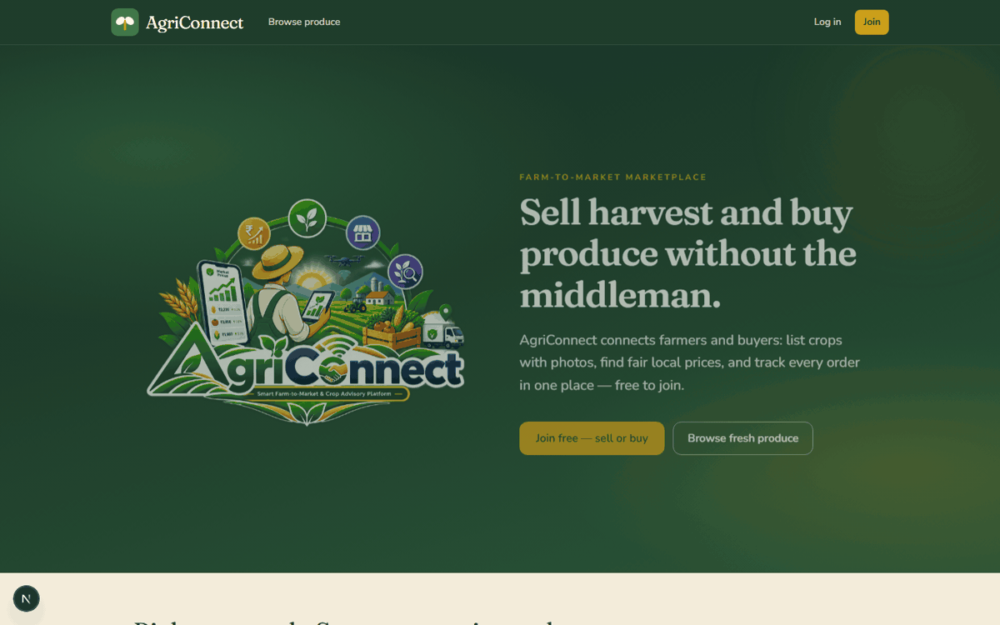
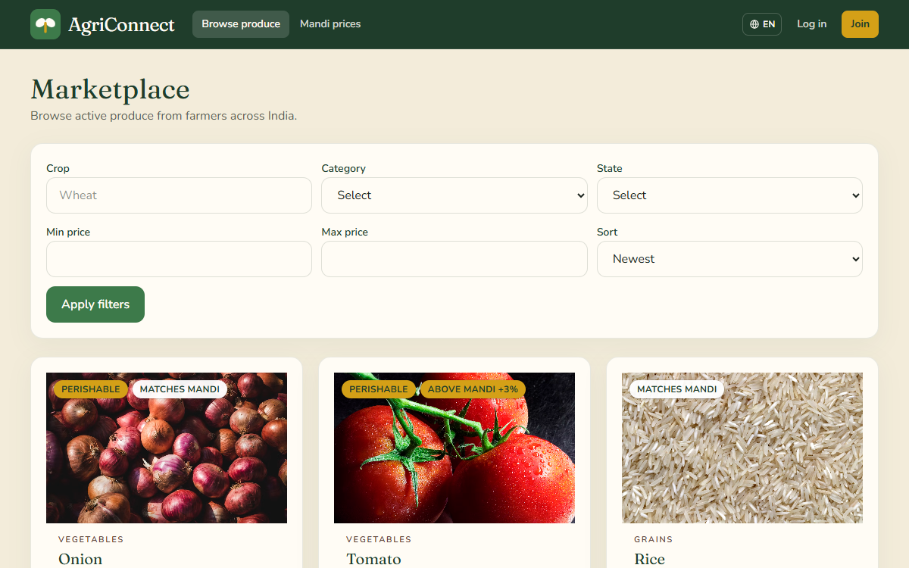
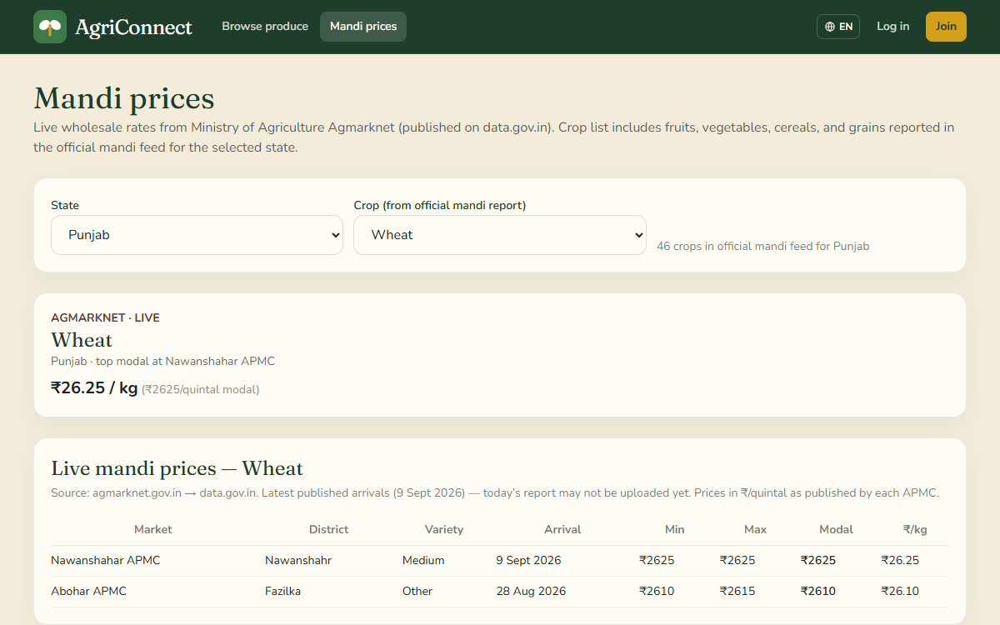
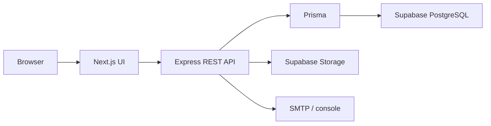
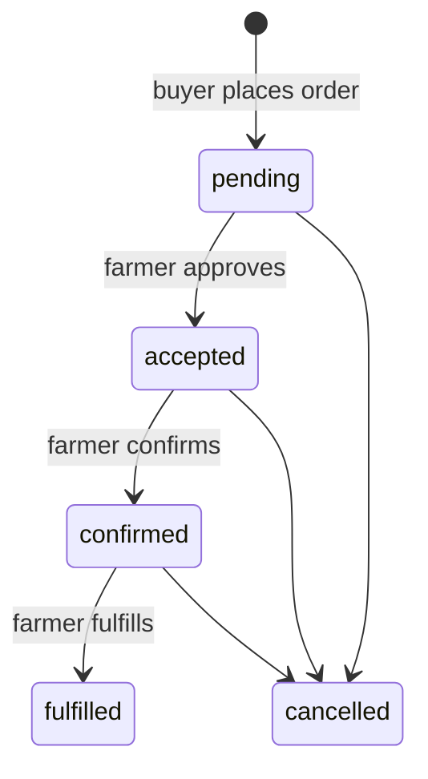

# AgriConnect


**Direct market access for farmers. Direct sourcing for buyers.**

[Web app](http://localhost:3000) · [API](http://localhost:5001) · [Health](http://localhost:5001/health) · [Ready](http://localhost:5001/ready) · `/api/v1`

---



*Landing → marketplace listings → live mandi prices (captured from the running app).*


|                                                                                                                           |                                                                                                                   |
| ------------------------------------------------------------------------------------------------------------------------- | ----------------------------------------------------------------------------------------------------------------- |
|  Browse produce, filter by crop and state, order from the farmer |  Agmarknet / data.gov.in mandi prices on `/market-prices` |


AgriConnect is a farmer-to-buyer agricultural marketplace. Farmers list produce with photos, price, and quantity. Buyers discover listings and place orders. Admins moderate users and listings. There is no middleman in the V1 product: price and stock live on the platform, and order progress is a visible state machine (pending → accepted → confirmed → fulfilled, or cancelled).

> [!NOTE]
> **One-line pitch:** Direct market access and price transparency for farmers, with a production-shaped CRUD foundation that can grow into real-time logistics (V2) and AI crop advisory (V3).

This repository is a **monorepo**: a Next.js web app and an Express REST API. The browser talks **only** to Express. Express talks to **Supabase PostgreSQL** (via Prisma) and **Supabase Storage** (listing photos). The frontend never receives database URLs, JWT secrets, or the Supabase service-role key.

> [!TIP]
> **New to the codebase?** After this README, open [docs/README.md](./docs/README.md).

---


## Who uses it


|                                        | Role       | What they do in V1                                                                                                                                 |
| -------------------------------------- | ---------- | -------------------------------------------------------------------------------------------------------------------------------------------------- |
|  | **Farmer** | Register, create draft listings, upload photos, publish, accept/confirm/fulfill incoming orders, cancel with a reason, view reports                |
|    | **Buyer**  | Register (trader / retailer / bulk / HORECA), browse the marketplace, place orders, cancel while the order is still `pending`, view spend reports  |
|    | **Admin**  | Seeded account (not self-register). Verify users, suspend/unsuspend, remove or reinstate listings, cancel orders, view analytics and activity logs |
|  | **Public** | Browse **active** listings and farmer public profiles (no email/phone)                                                                             |


---


## How the system works







1. User logs in. The API returns a short-lived **access JWT** in JSON. A **refresh token** is set as an HttpOnly cookie (`Path=/api/v1/auth`).
2. The UI keeps the access token **in memory** (not `localStorage`). Axios/fetch sends `Authorization: Bearer` plus cookies (`credentials: 'include'`).
3. When the access token expires (~15 minutes), the client calls `POST /api/v1/auth/refresh`, then retries.
4. Farmers create listings as **draft**, upload 1–5 photos (JPEG/PNG/WebP, ≤5 MB), then **PATCH** status to `active`.
5. Buyers place orders against **active** listings. Quantity is decremented in a database transaction so two buyers cannot oversell.
6. The farmer **approves** (`accepted`), **changes** (`confirmed` → `fulfilled`), or **discards** (`cancelled` + reason). Buyers may discard only from `pending`. Admins may only cancel.
7. Buyers pay through AgriConnect (UPI / card / net banking / cash on delivery). Gateway payments only reach **escrow** after the server reads the payment back from Razorpay or receives the signed webhook — money is released to the farmer on `fulfilled` and refunded on cancellation.
8. After **fulfilled**, buyer and farmer can rate each other; averages update on profiles.
9. **Order-scoped chat** uses REST + Socket.io (`join:order`, `message:new`) on the order detail page. Chat rejects phone numbers, emails, and UPI IDs — as do order notes and listing copy, the other places the counterparty reads — and the **in-app voice call** (`call:*` events, peer-to-peer WebRTC) is how the two parties talk, so contact details never need to be shared and the trade stays on-platform.
10. Farmers can open the **Kisan AI** widget (Gemini when `GEMINI_API_KEY` is set). Capstone Grounded Kisan upgrades the same chat: curated crop/scheme/weather answers with citations, refuse-when-empty, and escalation to a seeded agronomist for high-stakes asks.
11. In-app notifications fire on order and moderation events; the header badge polls and refreshes on mark-read.

**Hard rules**

- Frontend never queries Supabase tables or uses the service-role key.
- Money and quantities are PostgreSQL `NUMERIC`, serialized as **JSON strings** (`"25.00"`, `"500.000"`). Currency is INR.
- IDs are UUIDs. Dates are ISO-8601 UTC; `harvestDate` is `YYYY-MM-DD`.
- Errors use HTTP status codes plus `{ success: false, error: { code, message, fields? } }`. Success is `{ success: true, data }` (lists also include `pagination`).

---


## Why it exists

Farmers often lack a direct channel to buyers; buyers lack a reliable way to source from growers. Value leaks to opaque intermediary chains. AgriConnect V1 is the lab-ready marketplace that demonstrates:

- Full-stack CRUD with real auth and roles
- Listings, photo uploads, and inventory-safe orders
- Admin moderation and basic reports
- A contract that frontend and backend can share without sharing the database

What V1 is **not**: a payment processor, e-NAM replacement, logistics fleet, chat app, or ML service. Those are later phases (see [Roadmap](#roadmap-v1--v2--v3)).

---


## What is already built


| Area              | Capability                                                                                                                                     |
| ----------------- | ---------------------------------------------------------------------------------------------------------------------------------------------- |
| Auth              | Register (farmer/buyer), login, refresh, logout, `/me`, forgot/reset password, lockout after 5 failed logins; suspended users blocked at login |
| Profiles          | Farmer/buyer profiles, DPDP-style data export, soft-delete account                                                                             |
| Listings          | Draft → photos → active; search/filter; view counts; expire/sold-out; farmer unpublish or delete                                               |
| Orders            | Place order, inventory decrement, status machine, stock restore on cancel                                                                      |
| Chat              | Order-scoped messages (REST + Socket.io); typing indicators (V2); **contact details blocked** (phone / email / UPI / other apps) in chat, order notes, and listing copy, so trades stay on-platform |
| Voice calls (V2)  | In-app buyer ↔ farmer voice call (peer-to-peer WebRTC, Socket.io signalling) so **no phone number is ever exchanged**; ring / accept / decline / mute / hang-up |
| Reviews           | Ratings after `fulfilled`; `ratingAvg` on profiles and order detail                                                                            |
| Market (V2)       | Price trends API + `/market-prices`; live Punjab/India mandi via Agmarknet/data.gov.in                                                         |
| Buyer alerts (V2) | Crop/state alerts; `LISTING_PUBLISHED` notifications on new listings                                                                           |
| Logistics (V2)    | Order logistics checkpoints; farmer updates on order detail                                                                                    |
| Payments (V2)     | Methods: UPI / card / net banking / cash on delivery. Escrow hold → release on fulfilled, auto-refund on cancel. Every hold is **verified server-side** with Razorpay (read-back on confirm + signed `payment.captured` webhook), so a browser cannot mark an order paid; Razorpay sandbox optional, simulated without keys |
| Assistant         | Kisan AI widget (`GEMINI_API_KEY` optional); marketplace chat unchanged; crop/scheme/weather uses Grounded RAG with citations; pesticide/medical asks escalate to seeded `AGRONOMIST`; optional `OPENWEATHER_API_KEY` |
| i18n (V2)         | Every screen in 13 Indian languages (en, hi, pa, bn, ta, te, mr, gu, kn, ml, or, as, ur); language switcher; profile `languagePref` sync; served `<html lang>` and page metadata follow a locale cookie; dates, money, and quantities format per locale; server-written notifications and admin logs render in the reader's language from structured `params`; Urdu renders right-to-left (`dir` on `<html>`, logical spacing utilities) and every script ships its own Noto webfont; enforced by Vitest parity, render, width-budget, and hardcoded-string tests in CI |
| Notifications     | List, mark read, mark all read; header unread badge                                                                                            |
| Reports           | Farmer: listings / qty sold / revenue (fulfilled). Buyer: orders / spend (fulfilled)                                                           |
| Admin             | Users (search, suspend, verify), listing moderate, analytics, activity logs                                                                    |
| CI / QA           | GitHub Actions; `npx tsx scripts/integration-crud-check.ts` verifies API → Supabase writes                                                     |
| Docker (V2)       | `docker compose up` — postgres, API, Next.js web                                                                                               |


**Listing statuses:** `draft` → `active` ⇄ `draft`; `sold_out` / `expired` → `active`; `removed` is terminal for farmers (admin can reinstate). Hourly jobs warn before expiry and auto-expire due listings.

**Order statuses:** `pending` → `accepted` → `confirmed` → `fulfilled`, or `cancelled` from the first three. Full HTTP codes and illegal transitions: [docs/API_STATUS_CODES.md](./docs/API_STATUS_CODES.md).

**Not implemented (do not call):** `GET /api/v1/admin/reports.csv`.

---

**Tech stack**

Names only — install current patched releases; do not copy old version pins from docs.


| Layer           | Choice                                              | Role                                                  |
| --------------- | --------------------------------------------------- | ----------------------------------------------------- |
| Runtime         | Node.js **24+** (`engines` in backend)              | Both apps                                             |
| Language        | TypeScript (strict on the API)                      | Shared                                                |
| Web UI          | **Next.js** (App Router) + React + **Tailwind CSS** | `code/AgriConnect/frontend/`                          |
| HTTP client     | `fetch` wrapper in `frontend/src/lib/api`           | Bearer + cookie refresh                               |
| API             | **Express 5**                                       | `code/AgriConnect/backend/`                           |
| Validation      | **Zod**                                             | Env vars + every body/query/params                    |
| ORM             | **Prisma**                                          | `code/AgriConnect/backend/prisma/`                    |
| Database        | **PostgreSQL** on **Supabase**                      | App data                                              |
| Files           | **Supabase Storage** bucket `listings`              | Photos; service role on the server                    |
| Auth            | **jsonwebtoken** + bcryptjs                         | Access JWT + hashed refresh tokens                    |
| Email           | **Nodemailer**                                      | Password reset; console fallback if SMTP unset        |
| Security        | helmet, cors allowlist, express-rate-limit          | Headers, cookies, 100 req/min API, 10 failed auth/min |
| Real-time       | Socket.io (order chat + voice call signalling)       | Same host as API (`/socket.io`)                       |
| Logging         | pino                                                | Structured logs                                       |
| Tests           | Vitest + Supertest                                  | `backend`                                             |
| Local DB option | Docker Compose `postgres:16`                        | When not using cloud Postgres                         |
| API exploration | Postman collection                                  | `code/AgriConnect/backend/postman/`                   |


Payments/escrow (with Razorpay verification and a signed webhook), logistics tracking, and in-app voice calls shipped in V2. Still out of scope: farmer payouts and settlement, a separate ML service, MongoDB/Mongoose, Passport OAuth, and video calls.


**Repository layout**

```
ucs503p-AgriConnect/
├── assets/                   # Course template assets (logos, mkdocs extras)
├── code/AgriConnect/         # Application monorepo
│   ├── frontend/             # Next.js UI (port 3000)
│   ├── backend/              # Express API (port 5001)
│   ├── docker-compose.yml    # Optional local PostgreSQL + containers
│   └── scripts/
├── docs/                     # Contracts, architecture, guides
├── journals/                 # Weekly engineering journals
├── project-proposal/         # Proposal PDF + LaTeX
├── project-report-final/     # Final report (placeholder)
├── project-report-prototype-stage/  # Prototype report (placeholder)
├── reports/                  # Course report stubs
├── .github/workflows/        # CI (typecheck, lint, test)
├── instruction.md            # Engineering blueprint (practices, not this product)
└── README.md                 # This file
```

Each backend module is `routes` → thin `controller` → `service` (Prisma + rules) → Zod `schema`.


**Quick start**

### Prerequisites

- **Node.js 24** or newer and npm
- Git
- A **Supabase** project (PostgreSQL + Storage bucket `listings`), **or** Docker for local Postgres (`docker compose up -d postgres`)
- Windows: use `copy`; macOS/Linux: use `cp`

Do not commit `.env` or `.env.local`.

### 1. Backend

```bash
cd code/AgriConnect/backend
copy .env.example .env
```

Fill `code/AgriConnect/backend/.env`: `DATABASE_URL`, `DIRECT_URL`, `SUPABASE_*`, JWT secrets, `ENCRYPTION_KEY`, `ADMIN_SEED_EMAIL`, `ADMIN_SEED_PASSWORD`. See [docs/DEVELOPMENT_SETUP.md](./docs/DEVELOPMENT_SETUP.md).

```bash
npm ci
npm run prisma:generate
npm run prisma:migrate
npm run prisma:seed
npm run dev
```

If `prisma migrate deploy` fails on direct port 5432 (common with Supabase), use the pooler fallback:

```bash
npm run prisma:deploy:pooler
```

API: `http://localhost:5001`. Seeded admin is `ADMIN_SEED_EMAIL` / `ADMIN_SEED_PASSWORD`.

Optional: set `GEMINI_API_KEY` for live Kisan AI replies and spoken answers. Pin `GEMINI_TTS_MODEL=gemini-3.1-flash-tts-preview` so read-aloud does not probe slower TTS models. `GEMINI_THINKING_LEVEL` (`minimal` \| `low` \| `medium` \| `high`, default `minimal`) caps how much the model reasons before answering — Gemini 3 bills thinking tokens against the reply budget, so `minimal` keeps answers fast and complete. Raise it to `low` for more reasoning per answer. Spoken readout clips long replies (~280 chars) so voice stays quick while the full text remains on screen. Seeded agronomist (not self-registerable): `AGRONOMIST_SEED_EMAIL` / `AGRONOMIST_SEED_PASSWORD`. Optional `OPENWEATHER_API_KEY` for live weather snippets beside curated rules. Offline grounded eval: `cd code/AgriConnect/backend && npm run eval:grounded`.

Optional payments: set `RAZORPAY_KEY_ID` + `RAZORPAY_KEY_SECRET` for sandbox checkout. With keys present, `POST /orders/:id/payment/confirm` reads the payment back from Razorpay and refuses to escrow anything the gateway does not confirm. Add `RAZORPAY_WEBHOOK_SECRET` and point a Razorpay webhook (`payment.captured`, `payment.failed`) at `POST /api/v1/payments/webhook` so a hold still lands when the buyer closes the tab mid-checkout. Without keys, payments run in simulated mode and cash on delivery works either way.

Optional voice calls: `WEBRTC_ICE_SERVERS` (comma-separated STUN/TURN URLs) overrides the default public Google STUN. Add a **TURN** server for real-world use — STUN alone fails behind the symmetric NAT common on Indian mobile networks.

Optional: `DATA_GOV_IN_API_KEY` (free from [data.gov.in](https://data.gov.in)) — **recommended for production** mandi prices (all states, avoids free API rate limits). Fallback: `MANDI_API_BASE_URL` (default open mandi API). `MANDI_SYNC_ENABLED=true` syncs staple crops into price trends daily (not on every server start).

Optional local database:

```bash
cd code/AgriConnect
docker compose up -d postgres
```

Use the connection URL from `code/AgriConnect/backend/.env.example` for that container.

### 2. Frontend

```bash
cd code/AgriConnect/frontend
copy .env.example .env.local
```

`NEXT_PUBLIC_API_BASE_URL=http://localhost:5001` (no trailing slash).

```bash
npm install
npm run dev
```

UI: `http://localhost:3000`. Register a farmer or buyer, or log in as the seeded admin.

### 3. Verify

```bash
cd code/AgriConnect/backend
npm run typecheck
npm run lint
npm test
npm audit --audit-level=high
```

Frontend: `npm run lint && npm run typecheck && npm run check:i18n && npm test`. Confirm `/health` returns `{ "success": true, "data": { "status": "ok" } }`.

With the API running, verify frontend actions persist to Supabase:

```bash
cd code/AgriConnect/backend
npx tsx scripts/integration-crud-check.ts
```


**API at a glance**


| Method                | Path                                                     | Who                                  |
| --------------------- | -------------------------------------------------------- | ------------------------------------ |
| GET                   | `/health`, `/ready`                                      | Public                               |
| POST                  | `/api/v1/auth/register`, `/login`, `/refresh`, `/logout` | Public / cookie                      |
| GET                   | `/api/v1/auth/me`                                        | Any logged-in user                   |
| GET/POST/PATCH/DELETE | `/api/v1/listings`                                       | Public browse; farmer writes         |
| POST/GET/PATCH        | `/api/v1/orders`, `/orders/:id/status`                   | Buyer create; farmer/admin status    |
| GET/POST              | `/api/v1/orders/:id/messages`                            | Order chat (Socket.io `message:new`); contact info rejected |
| POST                  | `/api/v1/orders/:id/payment`, `/payment/confirm`         | Buyer pays; escrow hold after Razorpay verification |
| GET                   | `/api/v1/payments/methods`                               | Payment method picker catalog        |
| POST                  | `/api/v1/payments/webhook`                               | Razorpay only; HMAC-signed, no JWT   |
| POST/GET              | `/api/v1/orders/:id/reviews`                             | Ratings after fulfilled              |
| GET/POST              | `/api/v1/assistant/status`, `/assistant/query`           | Kisan AI (legacy + grounded)         |
| GET                   | `/api/v1/weather`                                        | Header live weather + rain outlook   |
| GET/PATCH             | `/api/v1/agronomist/escalations`                         | Agronomist advisory queue            |
| GET/PATCH/POST        | `/api/v1/notifications`                                  | Logged-in                            |
| GET                   | `/api/v1/reports/me`                                     | Farmer or buyer                      |
| GET/PATCH             | `/api/v1/admin/*`                                        | Admin only                           |


Auth header: `Authorization: Bearer <accessToken>`. Browser calls use cookies for refresh.


| HTTP      | Meaning (typical)                                |
| --------- | ------------------------------------------------ |
| 200 / 201 | Success / created                                |
| 400       | Validation or illegal approve / discard / change |
| 401       | Missing, expired, or invalid token; bad login    |
| 403       | Wrong role, suspended login, or suspended write  |
| 404       | Missing resource, or not yours (IDOR-safe)       |
| 409       | Email taken or not enough listing quantity       |
| 413 / 415 | Photo too large / wrong type                     |
| 429       | Rate limit                                       |
| 503       | Database down (`/ready`)                         |


Full shapes: [docs/API_CONTRACT.md](./docs/API_CONTRACT.md). Every route in one catalog: [docs/API_ENDPOINTS.md](./docs/API_ENDPOINTS.md). Every status and error: [docs/API_STATUS_CODES.md](./docs/API_STATUS_CODES.md). Postman: `code/AgriConnect/backend/postman/collection.json`.

### Web app routes


| Path                                                         | Purpose                                         |
| ------------------------------------------------------------ | ----------------------------------------------- |
| `/`                                                          | Landing                                         |
| `/login`, `/register`, `/forgot-password`, `/reset-password` | Auth                                            |
| `/marketplace`, `/listings/[id]`                             | Browse and listing detail                       |
| `/market-prices`                                             | Live mandi / price trends                       |
| `/farmer`, `/farmer/listings`, `/farmer/listings/new`        | Farmer home and listing CRUD                    |
| `/buyer`, `/buyer/alerts`                                    | Buyer home and crop alerts                      |
| `/orders`, `/orders/[id]`                                    | Order list; accept / confirm / fulfill / cancel |
| `/notifications`, `/profile`, `/dashboard`                   | Inbox, profile, role redirect                   |
| `/admin`, `/admin/users`, `/admin/listings`, `/admin/logs`   | Moderation and analytics                        |


**Scripts**

**Backend** (`cd code/AgriConnect/backend`)


| Script                                         | Purpose                                       |
| ---------------------------------------------- | --------------------------------------------- |
| `npm run dev`                                  | Watch server                                  |
| `npm run build` / `npm start`                  | Production compile + run                      |
| `npm run typecheck` / `lint` / `test`          | Quality gates                                 |
| `npm run prisma:generate` / `migrate` / `seed` | Database                                      |
| `npm run prisma:deploy:pooler`                 | Migrate via pooler when direct 5432 blocked   |
| `npx tsx scripts/integration-crud-check.ts`    | Live API → DB sync test (API must be running) |


**Frontend** (`cd code/AgriConnect/frontend`)


| Script                    | Purpose              |
| ------------------------- | -------------------- |
| `npm run dev`             | Next.js on port 3000 |
| `npm run build` / `start` | Production           |
| `npm run lint`            | ESLint               |
| `npm run typecheck`       | TypeScript, no emit  |
| `npm run check:i18n`      | Locale key parity    |
| `npm test`                | Vitest (i18n parity, hardcoded-string guard, width budget, Punjabi render tests) |
| `npm run test:watch`      | Vitest in watch mode |


---


## Documentation


| Document                                                 | Audience       | Contents                                            |
| -------------------------------------------------------- | -------------- | --------------------------------------------------- |
| [docs/README.md](./docs/README.md)                       | Anyone joining | Read order, known gaps, where to edit               |
| [docs/DEVELOPMENT_SETUP.md](./docs/DEVELOPMENT_SETUP.md) | Setup          | Env vars, Supabase, CORS, cookies                   |
| [docs/ARCHITECTURE.md](./docs/ARCHITECTURE.md)           | Technical      | Boundaries, request flow, security                  |
| [docs/DATABASE_DESIGN.md](./docs/DATABASE_DESIGN.md)     | Backend        | ERD, enums, inventory rules                         |
| [docs/API_ENDPOINTS.md](./docs/API_ENDPOINTS.md)         | Both           | Full catalog: HTTP, Socket, outbound                |
| [docs/API_CONTRACT.md](./docs/API_CONTRACT.md)           | Both           | Request/response JSON                               |
| [docs/API_STATUS_CODES.md](./docs/API_STATUS_CODES.md)   | Both           | Status codes, approve/discard/change                |
| [docs/FRONTEND_GUIDE.md](./docs/FRONTEND_GUIDE.md)       | Frontend       | Client, guards, screens                             |
| [docs/BACKEND_GUIDE.md](./docs/BACKEND_GUIDE.md)         | Backend        | Modules, AppError, adding endpoints                 |
| [docs/CHANGELOG.md](./docs/CHANGELOG.md)                 | Both           | What changed                                        |
| [docs/AgriConnect_PRD.md](./docs/AgriConnect_PRD.md)     | Product        | Goals, personas, later phases                       |
| [docs/PRD_AMENDMENTS.md](./docs/PRD_AMENDMENTS.md)       | Engineering    | Binding V1 stack/scope (wins over PRD on conflicts) |


Cursor agents: `.cursor/rules/update-api-docs.mdc` requires API docs to update whenever routes or `frontend/src/lib/api` change.

---


## Roadmap (V1 → V2 → V3)


| Phase              | Theme                                                       | Status                                         |
| ------------------ | ----------------------------------------------------------- | ---------------------------------------------- |
| **V1 — Lab**       | Auth, RBAC, listings, orders, admin, notifications, reports | Shipped                                        |
| **V2 — Prototype** | Chat, reviews, assistant, Docker/CI                         | Shipped in repo (chat, reviews, assistant, CI) |
| **V3 — Capstone**  | ML advisory service, market intelligence                    | Not started                                    |


---


## Security notes for reviewers

- Secrets stay in `code/AgriConnect/backend/.env`. The only public frontend env is `NEXT_PUBLIC_API_BASE_URL`.
- Refresh tokens are hashed in the database, rotated on every refresh, and reuse of an old token revokes the user’s refresh family.
- Suspended users cannot log in (**403** `ACCOUNT_SUSPENDED`) but may still refresh and load `/me` if they were signed in before suspension (UI shows blocked state). Writes use `requireActiveAccount` (listings, orders, chat, reviews, assistant query, profile).
- Rate limits apply to `/api` and more strictly to `/api/v1/auth`.
- Ownership checks return **404**, not 403, so listings/orders of other users are not confirmed to exist.

