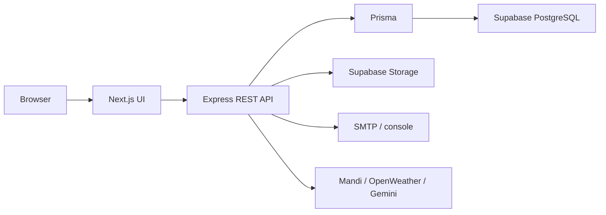
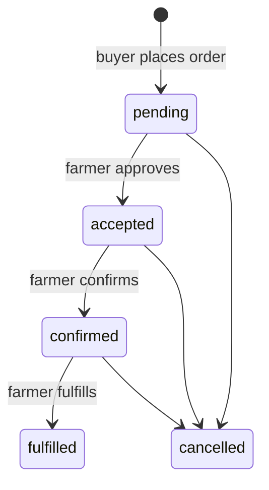

# AgriConnect

<p align="center">
  
</p>

<p align="center">
  
  
  
  
  
  
</p>


<p align="center"><strong>Smart farm-to-market marketplace + crop advisory</strong> · UCS503P (TIET)</p>

<p align="center">
  Farmers list produce · see live mandi benchmarks · trade on-platform · ask <strong>Grounded Kisan</strong> (cite / refuse / escalate)
</p>

<p align="center">
  <a href="#key-features">Key features</a> ·
  <a href="#quick-start">Quick start</a>
</p>

> **Open the app:** UI → http://localhost:3000 · API health → http://localhost:5001/health  
> (Port **5001** is the API only — `GET /` returning NOT_FOUND is expected.)

| | |
|---|---|
| **Team** | Kabir Manchanda (1024030415), Manbhav Kumar Terry (1024030427) |
| **Course** | UCS503P · Submitted to Mr. Hardik |
| **App code** | `code/AgriConnect/` |

---

## Contents

- [Demo](#demo)
- [Key features](#key-features)
- [Why it exists](#why-it-exists)
- [Project phases](#project-phases)
- [Who uses it](#who-uses-it)
- [Quick start](#quick-start)
- [More detail](#more-detail)

---

## Demo

<p align="center">
  
</p>

<p align="center"><em>Landing → marketplace → live mandi prices (from the running app).</em></p>

<p align="center">
  
  &nbsp;
  
</p>

<p align="center"><em>Browse produce · Agmarknet / data.gov.in on <code>/market-prices</code></em></p>

---

## ⭐ Key features

### 1. 🌾 Direct farm-to-buyer marketplace
- **Produce listings with photos:** farmers publish crop, quantity, expected price, and location; buyers filter by crop and state.
- **Inventory-safe orders:** quantity decrements in a database transaction so two buyers cannot oversell the same lot.
- **Visible order lifecycle:** `pending → accepted → confirmed → fulfilled` (or `cancelled`) — every step is logged and role-gated.

### 2. 📈 Live mandi price intelligence
- **Agmarknet / data.gov.in feed:** farmers see wholesale benchmarks on `/market-prices` before they accept a weak farm-gate offer.
- **Buyer produce alerts:** standing crop/state alerts notify when a matching listing goes live.
- **Price transparency first:** the primary success metric of the project — close the gap between listed price and live mandi price.

### 3. 📞 Stay-on-platform trade (chat + voice)
- **Order-scoped chat:** REST + Socket.io with typing indicators — conversation stays tied to the deal.
- **In-app voice calls:** peer-to-peer WebRTC so parties never need to exchange a phone number.
- **Anti-bypass contact guard:** phone numbers, emails, and UPI IDs are blocked in chat, order notes, and listing copy (`CONTACT_INFO_BLOCKED`).

### 4. 🔒 Escrow-style payments buyers can trust
- **Methods that match India:** UPI, card, net banking, and cash on delivery.
- **Server-verified escrow:** gateway holds only land after Razorpay read-back or a signed webhook — the browser cannot mark an order paid.
- **Clean unwind:** release on `fulfilled`, auto-refund path on cancel (farmer payout settlement still later).

### 5. 🌱 Grounded Kisan — cite, refuse, escalate
- **Same farmer widget, Capstone brain:** curated crop / scheme / weather knowledge with **source citations**, not freestyle hallucination.
- **Refuse when empty:** if retrieval confidence is low, Kisan says so instead of inventing doses.
- **Agronomist handoff:** pesticide / medical / high-stakes asks escalate to a seeded **AGRONOMIST** queue.
- **Live weather context:** profile-based outlook (optional OpenWeather) in the header and inside advisory replies.
- **Spoken answers:** optional Gemini TTS so farmers can listen while working in the field.

### 6. 🌍 Built for Indian farmers & faculty demos
- **13 languages:** English, Hindi (हिंदी), Punjabi (ਪੰਜਾਬੀ), Bengali (বাংলা), Tamil (தமிழ்), Telugu (తెలుగు), Marathi (मराठी), Gujarati (ગુજરાતી), Kannada (ಕನ್ನಡ), Malayalam (മലയാളം), Odia (ଓଡ଼ିଆ), Assamese (অসমীয়া), Urdu (اردو) — with **RTL** for Urdu.
- **Admin trust layer:** verify / suspend users, moderate listings, analytics, and an attributed activity log.
- **Ship-ready stack:** JWT + refresh cookies, Zod validation, Prisma + Supabase, Docker Compose, GitHub Actions CI.

---

## Why it exists

Small and mid-size farmers often sell without an independent price benchmark, lack a trustworthy buyer channel, and get crop advice too late. AgriConnect folds those three needs into one accountable web platform — marketplace, mandi transparency, and grounded advisory — without putting secrets or the database in the browser.

> **Pitch:** Direct market access and price transparency for farmers, with a production-shaped stack that already ships real-time trade tools and Capstone-grade grounded advisory.

---

## Project phases

Faculty-facing growth model (**Lab → Prototype → Capstone**). Internal tags V1/V2/V3 and `/api/v1` are release/API versioning — not the course phases.

| Phase | Theme | Status |
|---|---|---|
| **Lab** | Auth, RBAC, listings, orders, admin, notifications, reports | **Complete** |
| **Prototype** | Chat, voice calls, mandi, logistics, escrow payments, 13-locale UI, Docker/CI | **Complete** |
| **Capstone** | Grounded Kisan (RAG + cite/refuse), agronomist escalation, profile weather | **In progress** (core shipped) |

---

## Who uses it

| | Role | What they do |
|---|---|---|
|  | **Farmer** | List, sell, chat/call, ask Kisan |
|  | **Buyer** | Browse, order, pay, rate |
|  | **Admin** | Moderate users & listings (seeded) |
| | **Agronomist** | High-stakes advisory queue (seeded) |
|  | **Guest** | Browse active listings (no contact PII) |

---

<details>
<summary><strong>What is already built</strong> — click to expand full capability table</summary>

<br/>

| Area | Capability |
|---|---|
| **Auth** | Register (farmer/buyer), login, refresh cookie, logout, `/me`, forgot/reset password, lockout, suspended-account gates |
| **Listings** | Draft → photos → active; search/filter; expiry jobs; sold-out / removed |
| **Orders** | Inventory-safe place; `pending → accepted → confirmed → fulfilled` (or `cancelled`) |
| **Chat** | Order-scoped REST + Socket.io; typing; **contact details blocked** (phone/email/UPI) |
| **Voice calls** | In-app WebRTC + Socket.io signalling (no phone number exchange) |
| **Payments** | UPI / card / netbanking / COD; escrow after Razorpay verify + signed webhook; refund on cancel |
| **Market** | Live mandi feed + `/market-prices`; buyer crop/state alerts |
| **Logistics** | Order checkpoint updates on the order detail page |
| **Reviews** | After `fulfilled`; averages on profiles |
| **Kisan AI** | Same widget: legacy marketplace help + **Grounded RAG** (cite / refuse / escalate); TTS optional |
| **Weather** | Profile-based live outlook (`OPENWEATHER_API_KEY`); header chip + advisory context |
| **i18n** | 13 Indian languages; RTL Urdu; locale-aware money/dates; CI parity tests |
| **Admin / reports** | Moderation, analytics, activity logs; farmer revenue & buyer spend reports |
| **CI / Docker** | GitHub Actions; `docker compose` for Postgres + API + web |

**Not yet:** farmer payout settlement via gateway, TURN for strict-NAT calls, crop CV / ML price models, native-speaker locale polish.

</details>

---

<details>
<summary><strong>How the system works</strong> — architecture, order flow, hard rules</summary>

<br/>





1. Login returns a short-lived **access JWT**; **refresh** is an HttpOnly cookie (`Path=/api/v1/auth`).
2. The UI keeps the access token **in memory** (not `localStorage`) and sends `Authorization: Bearer` + cookies.
3. Farmers publish listings with photos; buyers order against **active** stock in a DB transaction.
4. Chat and voice stay on-platform; contact strings are rejected so deals are not bypassed.
5. Payments reach escrow only after **server-side** Razorpay confirmation (or signed webhook).
6. Grounded Kisan retrieves curated knowledge, **cites** sources, **refuses** when empty, and escalates pesticide/medical asks to a seeded agronomist.

**Hard rules**

- Frontend never talks to Supabase with service-role keys or DB URLs.
- Money/quantity are PostgreSQL `NUMERIC`, JSON-serialized as **strings** (`"25.00"`). Currency INR.
- Errors: `{ success: false, error: { code, message, fields? } }`. Success: `{ success: true, data }` (+ `pagination` on lists).

</details>

---

<details>
<summary><strong>Repository layout</strong></summary>

<br/>

```
ucs503p-AgriConnect/
├── code/AgriConnect/          # Application (run everything from here)
│   ├── backend/               # Express API · port 5001
│   ├── frontend/              # Next.js UI · port 3000
│   ├── docker-compose.yml
│   └── scripts/
├── docs/                      # Contracts, guides, weekly progress, decks
├── journals/                  # Per-student weekly journals
├── project-proposal/          # PDF + LaTeX (Submitted to Mr. Hardik)
├── project-report-final/      # Placeholder
├── project-report-prototype-stage/
├── reports/                   # Course report stubs
├── assets/                    # TIET / mkdocs assets
└── .github/workflows/ci.yml
```

Backend modules follow `routes → controller → service → Zod schema`.

</details>

---

## Quick start

### Prerequisites

- Node.js **24+** and npm  
- Git  
- Supabase project (Postgres + Storage bucket `listings`), **or** Docker Postgres  
- Do **not** commit `.env` / `.env.local`

### 1. Backend

```bash
cd code/AgriConnect/backend
copy .env.example .env          # macOS/Linux: cp .env.example .env
```

Set at least: `DATABASE_URL`, `DIRECT_URL`, `SUPABASE_*`, JWT secrets, `ENCRYPTION_KEY`, `ADMIN_SEED_EMAIL`, `ADMIN_SEED_PASSWORD`.  
Full env list: `docs/DEVELOPMENT_SETUP.md`.

```bash
npm ci
npm run prisma:generate
npm run prisma:migrate          # or: npm run prisma:deploy:pooler
npm run prisma:seed
npm run dev
```

API: http://localhost:5001 · health: http://localhost:5001/health

Optional local DB:

```bash
cd code/AgriConnect
docker compose up -d postgres
```

### 2. Frontend

```bash
cd code/AgriConnect/frontend
copy .env.example .env.local
```

Set `NEXT_PUBLIC_API_BASE_URL=http://localhost:5001` (no trailing slash).

```bash
npm ci
npm run dev
```

UI: http://localhost:3000 — register a farmer/buyer, or use the seeded admin.

<details>
<summary><strong>Optional integrations</strong></summary>

<br/>

| Env | Effect |
|---|---|
| `GEMINI_API_KEY` | Live Kisan replies + TTS |
| `OPENWEATHER_API_KEY` | Live weather chip / advisory context |
| `RAZORPAY_KEY_ID` + `RAZORPAY_KEY_SECRET` (+ webhook secret) | Real sandbox escrow; without keys, payments simulate |
| `DATA_GOV_IN_API_KEY` | Broader mandi coverage / fewer rate limits |
| `WEBRTC_ICE_SERVERS` | Custom STUN/TURN (TURN recommended off campus NAT) |

Grounded advisory offline eval: `cd code/AgriConnect/backend && npm run eval:grounded`

</details>

<details>
<summary><strong>Verify</strong> — typecheck, lint, tests</summary>

<br/>

```bash
# Backend
cd code/AgriConnect/backend
npm run typecheck && npm run lint && npm test

# Frontend
cd code/AgriConnect/frontend
npm run lint && npm run typecheck && npm run check:i18n && npm test
```

Confirm `/health` → `{ "success": true, "data": { "status": "ok" } }`.  
With the API up: `npx tsx scripts/integration-crud-check.ts` (from `backend/`).

</details>

---

<details>
<summary><strong>API & screens (glance)</strong></summary>

<br/>

| Method | Path | Who |
|---|---|---|
| GET | `/health`, `/ready` | Public |
| POST | `/api/v1/auth/*` | Public / cookie refresh |
| CRUD | `/api/v1/listings` | Public browse; farmer writes |
| POST/PATCH | `/api/v1/orders`, `…/status`, `…/payment` | Buyer / farmer / admin |
| GET/POST | `/api/v1/orders/:id/messages` | Order parties (contact blocked) |
| GET/POST | `/api/v1/assistant/*` | Kisan (legacy + grounded) |
| GET | `/api/v1/weather` | Logged-in weather outlook |
| GET/PATCH | `/api/v1/agronomist/escalations` | Agronomist |
| GET/PATCH | `/api/v1/admin/*` | Admin |

| UI route | Purpose |
|---|---|
| `/`, `/marketplace`, `/listings/[id]` | Landing & browse |
| `/market-prices` | Live mandi |
| `/farmer/*`, `/buyer/*`, `/orders/*` | Role dashboards & trade |
| `/admin/*` | Moderation |

Full contract and endpoint catalog live under `docs/`. Postman collection: `code/AgriConnect/backend/postman/`.

</details>

---

<details>
<summary><strong>Tech stack</strong></summary>

<br/>

| Layer | Choice |
|---|---|
| UI | Next.js (App Router), React, Tailwind |
| API | Express 5, Zod, Prisma |
| Data | Supabase PostgreSQL + Storage |
| Auth | JWT access + hashed refresh cookies |
| Realtime | Socket.io (chat + call signalling) |
| Tests | Vitest (+ Supertest on API) |
| CI | GitHub Actions on `master` / feature branches |

Still out of scope: MongoDB, Passport OAuth, video calls, a separate ML microservice.

</details>

---

## More detail

Deep docs (setup, API contract, architecture, weekly board, proposal) are in the `docs/` and `project-proposal/` folders.

<details>
<summary><strong>Security notes for reviewers</strong></summary>

<br/>

- Secrets live only in `code/AgriConnect/backend/.env`. Frontend public env: `NEXT_PUBLIC_API_BASE_URL` only.
- Refresh tokens are hashed, rotated, and reuse-revoked as a family.
- Suspended accounts cannot log in (`403 ACCOUNT_SUSPENDED`); writes require an active account.
- Rate limits on `/api` and stricter on `/api/v1/auth`.
- Cross-user ownership misses return **404** (IDOR-safe), not 403.

</details>
