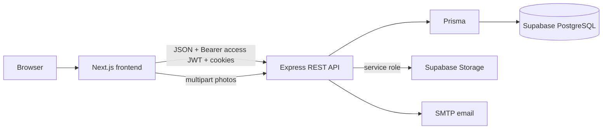
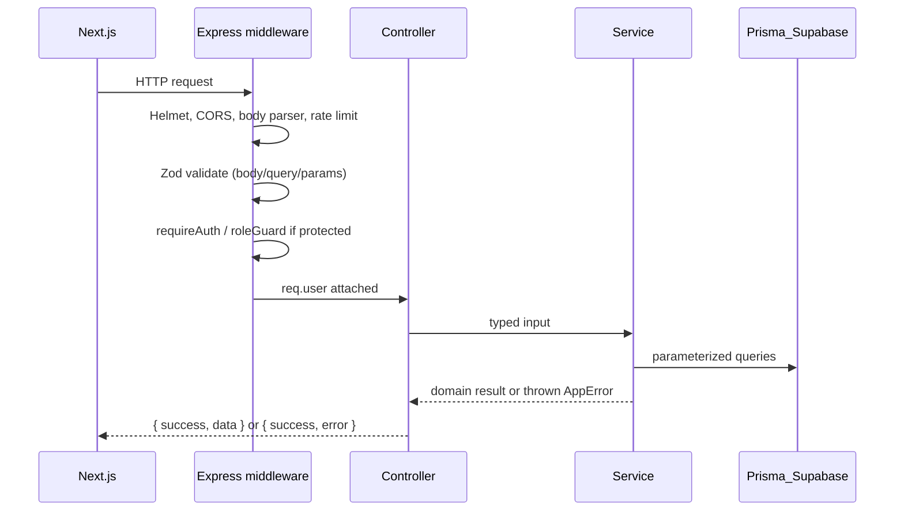
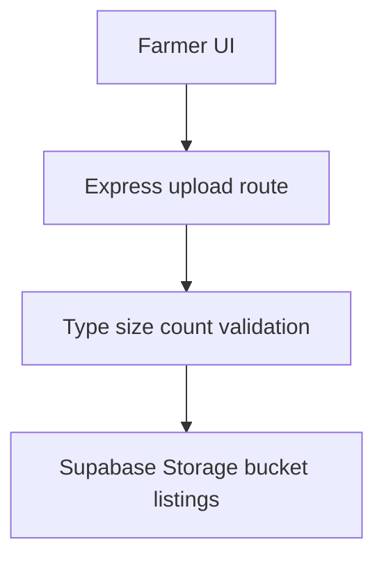

# AgriConnect — Architecture

> **Phase:** 0 (design only)
> **Version:** 1.0
> **Status:** Binding for V1
> **Related:** [PRD](./AgriConnect_PRD.md), [Amendments](./PRD_AMENDMENTS.md), [Database](./DATABASE_DESIGN.md), [API Contract](./API_CONTRACT.md)

---

## 1. Purpose

AgriConnect is a farmer-to-buyer agricultural marketplace. V1 is a production-shaped CRUD platform with authentication, RBAC, listings, orders, notifications, admin moderation, and basic reports.

This document describes **how the system is built**, not product features. Product scope lives in the PRD; V1 cuts live in [PRD_AMENDMENTS.md](./PRD_AMENDMENTS.md).

---

## 2. Locked stack

| Layer | Choice | Notes |
|---|---|---|
| Frontend | Next.js (App Router) + TypeScript + Tailwind CSS | Talks only to Express |
| Backend | Node.js + Express + TypeScript (strict) | Single REST API |
| Database | PostgreSQL on **Supabase** | No MongoDB, no Neon |
| ORM | Prisma | Schema at `backend/prisma/` |
| Validation | Zod | Env vars + every request body/query/params |
| Auth | JWT access + refresh | Refresh in HttpOnly cookie |
| Storage | Supabase Storage | Listing photos; service role on server only |
| Email | Nodemailer | Console fallback in development if SMTP unset |
| Realtime | Socket.io | **V2 only** |
| ML | Python + FastAPI | **V3 only**, separate service |

**Version Safety:** Do not copy package versions from this file. At install time, web-search each dependency + run `npm show <pkg> version` and check advisories. Use `^` ranges unless pinning a verified patched release.

**Node runtime:** Use current **Active LTS** at implementation time (verify on nodejs.org). Do not copy an LTS number from the PRD.

---

## 3. System context



### Non-negotiable rules

1. The frontend never uses the Supabase JS client for **database** reads/writes.
2. The frontend never receives `SUPABASE_SERVICE_ROLE_KEY`, `DATABASE_URL`, or JWT secrets.
3. Express is the only application API. Prisma is the only data access layer for app tables.
4. Listing photo bytes go: Farmer → Next.js → Express (validate) → Supabase Storage. Public photo **URLs** may be returned in API JSON.

---

## 4. Repository layout

```
AgriConnect/
├── frontend/                 # Next.js — UI teammate
├── backend/
│   ├── src/
│   │   ├── server.ts         # Connect Prisma → listen
│   │   ├── app.ts            # Middleware stack + route mounts
│   │   ├── config/           # env.ts (Zod), db.ts, cookies.ts
│   │   ├── middleware/       # requireAuth, roleGuard, validate, errorHandler
│   │   ├── modules/
│   │   │   ├── auth/
│   │   │   ├── users/
│   │   │   ├── listings/
│   │   │   ├── orders/
│   │   │   ├── notifications/
│   │   │   └── admin/
│   │   ├── services/         # email, storage, notification fan-in
│   │   ├── utils/            # jwt, ownershipCheck, tokenCompare, asyncHandler
│   │   └── types/            # express.d.ts
│   ├── prisma/               # schema.prisma, migrations/, seed
│   ├── postman/
│   ├── tests/
│   ├── .env.example
│   ├── package.json
│   └── tsconfig.json         # strict: true
├── docs/
├── .gitignore
├── .cursorignore
├── README.md
└── docker-compose.yml
```

**Why no root `prisma/`:** migrations, seed, and Prisma Client generation belong to the Express service. A root Prisma project would split ownership and confuse the frontend teammate.

**V2/V3 folders (do not create until needed):** `backend/src/sockets/`, `ml-service/`.

Each backend module contains:

- `*.routes.ts` — wire middleware + controller
- `*.controller.ts` — parse request, call service, send envelope (thin)
- `*.service.ts` — business logic + Prisma
- `*.schema.ts` — Zod schemas for that module

---

## 5. Request flow



Controllers never talk to Prisma directly. Services never read `req` / `res`.

---

## 6. Middleware stack (`app.ts` order)

Order matters.

1. Helmet (security headers; CSP tuned for API)
2. CORS — explicit origin list from `CORS_ORIGINS`, `credentials: true`, never `*`
3. Cookie parser (refresh cookie)
4. `express.json({ limit: '10kb' })` except multipart upload routes
5. URL-encoded parser
6. HTTP logging in development (morgan or pino-http)
7. Global rate limit on `/api` (exclude `/health` and `/ready`)
8. Stricter rate limit on `/api/v1/auth`
9. Routes under `/api/v1`
10. 404 handler for unknown routes
11. Central `errorHandler` (always last)

Multipart listing-photo routes use a higher body limit **only on that path**, with file-type/size checks in the upload middleware.

Do **not** install `express-mongo-sanitize`.

---

## 7. Authentication model

### Tokens

| Token | Lifetime | Transport | Storage |
|---|---|---|---|
| Access JWT | 15 minutes | `Authorization: Bearer` | Frontend **memory** (`tokenStore`) |
| Refresh | 7 days | Cookie `refreshToken` | HttpOnly + Secure + SameSite=Strict; **hash** in DB |

Cookie flags in production: `HttpOnly; Secure; SameSite=Strict; Path=/api/v1/auth`. In local HTTP development, `Secure` may be off so cookies work on `localhost`; production always sets `Secure`.

### Claims (access JWT)

```
sub: userId (uuid)
role: FARMER | BUYER | ADMIN
typ: access
iat, exp
```

Use a **different** secret for refresh tokens (`JWT_REFRESH_SECRET`). Refresh payload: `sub`, `jti` (refresh token row id), `typ: refresh`.

### Rotation and reuse detection

1. Login / register: create `RefreshToken` row with bcrypt hash, set cookie.
2. Refresh: look up by `jti`, verify cookie against hash (timing-safe), ensure not expired/revoked.
3. If valid: revoke old row, insert new row, set new cookie, return new access token.
4. If token was already revoked but presented again: **revoke all** tokens for that `userId`, return `401 REFRESH_TOKEN_INVALID`.

### Password hashing

bcrypt (or bcryptjs) cost factor **≥ 10**. Never log passwords or tokens.

### Session bootstrap (frontend)

On load: `POST /api/v1/auth/refresh` (cookie) → store access token in memory → `GET /api/v1/auth/me`. If refresh fails, user is logged out.

Axios/fetch: `withCredentials: true`. Separate refresh client **without** the 401 interceptor (prevents loops). Single-flight refresh queue on `TOKEN_EXPIRED`.

---

## 8. Authorization (RBAC)

Middleware:

- `requireAuth` — missing/invalid/expired access token → 401 (`UNAUTHORIZED` | `TOKEN_EXPIRED` | `TOKEN_INVALID`)
- `roleGuard(...roles)` — authenticated but wrong role → 403 `FORBIDDEN`
- Service-level `assertOwnership` — wrong owner → 404 `NOT_FOUND`

| Action | FARMER | BUYER | ADMIN |
|---|---|---|---|
| Register as farmer/buyer | yes | yes | no (seeded) |
| Create/update/delete own listing | yes | no | no |
| Browse active listings | yes | yes | yes |
| Place order | no | yes | no |
| Accept/confirm/fulfill own incoming orders | yes | no | no |
| Cancel own pending order | no* | yes | yes |
| Moderate listing / suspend user | no | no | yes |
| Platform analytics | own reports | own reports | all |

\*Farmer may cancel before fulfillment per order state machine (see database design). Buyer may cancel while `pending`.

Suspended users authenticate then receive **403 `ACCOUNT_SUSPENDED`** on mutating marketplace routes (create listing, create order). `GET /auth/me` still works so the UI can show the suspended state.

---

## 9. Error handling

Throw a typed `AppError` (`statusCode`, `code`, `message`, `fields?`). The central handler:

- Maps Zod errors → 400 `VALIDATION_ERROR`
- Maps Prisma unique violations → 409 `CONFLICT`
- Maps Prisma record not found → 404 `NOT_FOUND`
- Never leaks stack traces in production
- Redacts secrets/PII from logs

---

## 10. File uploads



Rules (V1):

- Allowed MIME: `image/jpeg`, `image/png`, `image/webp`
- Max size: **5 MB** per file
- Max **5** photos per listing
- Min **1** photo before a listing may transition `draft` → `active` (draft may have zero)
- Server uses **service role** to upload; bucket can be public-read for objects under `listings/{listingId}/` **or** return signed URLs. Prefer **public bucket with unguessable object keys** (UUID filenames) for V1 simplicity; do not expose the service role.
- Replace/delete photo: farmer owner or admin only

---

## 11. Notifications (V1)

- Persist rows in `Notification`
- Create from order/listing services (same request, not a queue in V1)
- Email via `email.service.ts` (Nodemailer); if SMTP unset in development, log the message
- Frontend polls `GET /api/v1/notifications` (Socket.io push is V2)
- Types: `ORDER_PLACED`, `ORDER_STATUS_CHANGED`, `LISTING_EXPIRING`, `ACCOUNT_SUSPENDED`, `LISTING_MODERATED`

Listing expiry emails: `node-cron` daily job marks `active` listings past a configurable window (default: 14 days after `harvestDate` or `expiresAt`) as `expired` and notifies the farmer.

---

## 12. Module boundaries

| Module | Owns |
|---|---|
| `auth` | Register, login, refresh, logout, me, password reset, refresh-token table |
| `users` | Profile get/update, farmer/buyer profile, data export, account delete |
| `listings` | CRUD, search/filter, photos, status transitions |
| `orders` | Create, list, get, status machine, inventory decrement |
| `notifications` | List, mark read |
| `admin` | User suspend/verify, listing moderate, analytics, activity log |

Shared: `services/email.service.ts`, `services/storage.service.ts`, `services/notification.service.ts`.

---

## 13. Frontend architecture (contract for UI teammate)

- Next.js App Router under `frontend/`
- Central API client (`lib/api/client.ts`) — no ad-hoc `fetch` in feature components
- In-memory `tokenStore`; AuthProvider bootstraps via refresh
- Route guards: auth + role
- Feature folders: `listings/`, `orders/`, `auth/`, `admin/`, `notifications/`, `profile/`
- Forms: React Hook Form + Zod (or equivalent), matching API schemas
- Shared UI: loading, error, empty states — not cards-as-decoration unless they wrap an interaction
- Env: Zod-validated `NEXT_PUBLIC_API_BASE_URL` only for V1

Pages required by V1: landing, login, register, farmer dashboard, buyer dashboard, listing create/edit/discovery/detail, orders, profile, notifications, admin dashboard.

---

## 14. Extension points (no V1 rewrite)

| Future | How V1 prepares |
|---|---|
| Socket.io | `server.ts` uses HTTP server (not `app.listen` only) so Socket.io can attach in V2 |
| Payments | `Order` has `priceTotal`; no payment rows in V1. V2 adds `Payment` 1:1 |
| Reviews | After `fulfilled`; V2 `Review` unique on `orderId` + `fromUserId` |
| Chat | V2 `Message` keyed by `orderId` |
| Price trends | V2 table; V1 listings already have crop/region/price |
| FPO | `FarmerProfile.fpoId` nullable, no FK in V1 (or FK to unused `Fpo` table — **V1: nullable uuid without FK** to avoid empty table) |
| ML service | Backend will proxy in V3; frontend still never calls FastAPI directly |

---

## 15. Deployment shape (V1 target, implemented in Phase 14)

| Piece | Target |
|---|---|
| Frontend | Vercel |
| Backend | Render or Railway |
| Database / Storage | Supabase |
| HTTPS | Required in production (Secure cookies) |

Local development may use Supabase cloud Postgres (recommended) or a documented `docker-compose` Postgres **only if** `DATABASE_URL` still matches Prisma; production is always Supabase.

---

## 16. Security baseline (V1)

Inherited from blueprint §6 / §8, adapted:

- Zod env crash on boot
- Helmet, CORS allowlist, rate limits
- Prisma only (no string-concatenated SQL)
- Ownership checks, RBAC
- Hashed passwords and refresh tokens
- File upload validation
- Admin activity log for suspend/verify/remove
- `GET /health`, `GET /ready`
- `.env` never committed; `.env.example` committed
- `.cursorignore` mirrors secrets so they are not indexed into AI context

Sentry is optional in V1 (DSN optional in env). Winston structured logs in production with redaction.

---

## 17. Testing strategy

Backend (required for V1 gate):

- Unit: order state machine, listing status transitions, ownership helper
- Integration: register, login, refresh, logout, protected route, role 403
- Integration: create/update/delete listing; create order; order authz; admin suspend

Frontend: component tests where useful; one happy-path auth + listing flow if time allows.

---

## 18. Git

Branches: `main` ← `develop` ← `feature/backend-*` / `feature/frontend-*`.

Do not commit `.env`, `node_modules`, keys, or generated `dist`.
