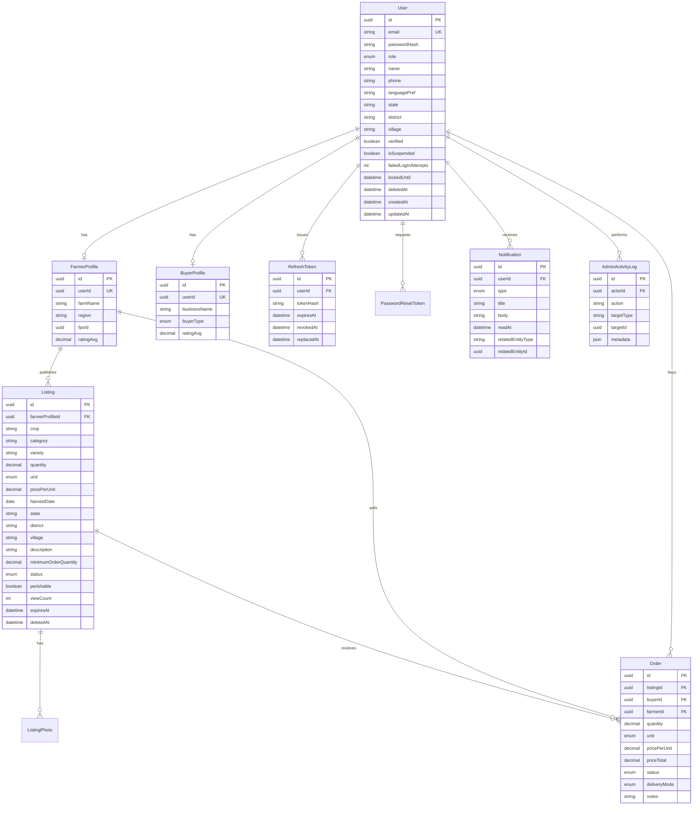

# AgriConnect — Database Design

> **Phase:** 0
> **ORM:** Prisma → PostgreSQL (Supabase)
> **Schema path (V1):** `backend/prisma/schema.prisma`
> **Related:** [Architecture](./ARCHITECTURE.md), [API Contract](./API_CONTRACT.md)

---

## 1. Design goals

1. Referential integrity for marketplace flows (an order always points at one listing, one buyer, one farmer).
2. UUID primary keys everywhere (no serial IDs, no Mongo ObjectIds).
3. Enums in PostgreSQL for statuses and roles so invalid states cannot be stored.
4. Indexes that match V1 query patterns (browse listings, list my orders).
5. V2/V3 entities documented now so V1 columns do not paint us into a corner — **those tables are not migrated in V1** except where a nullable column is cheap insurance (`FarmerProfile.fpoId`).

---

## 2. ERD (V1)



---

## 3. Enums

```prisma
enum Role {
  FARMER
  BUYER
  ADMIN
}

enum ListingStatus {
  draft
  active
  sold_out
  expired
  removed
}

enum OrderStatus {
  pending
  accepted
  confirmed
  fulfilled
  cancelled
}

enum Unit {
  kg
  quintal
  ton
}

enum DeliveryMode {
  pickup
  delivery
}

enum BuyerType {
  trader
  retailer
  bulk
  horeca
}

enum NotificationType {
  ORDER_PLACED
  ORDER_STATUS_CHANGED
  LISTING_EXPIRING
  ACCOUNT_SUSPENDED
  LISTING_MODERATED
  PASSWORD_RESET
}
```

Prisma `enum` names are PascalCase in the schema; stored values for listing/order/unit match the API contract (snake_case / lowercase as above). Implementation must emit **exactly** these JSON strings.

Do **not** add `AGRONOMIST` or `FPO` to `Role` in V1.

---

## 4. Tables (V1)

Conventions for every table unless noted:

- `id UUID PRIMARY KEY DEFAULT gen_random_uuid()`
- `createdAt TIMESTAMPTZ NOT NULL DEFAULT now()`
- `updatedAt TIMESTAMPTZ NOT NULL` (Prisma `@updatedAt`)

### 4.1 User

| Column | Type | Constraints |
|---|---|---|
| id | UUID | PK |
| email | TEXT | UNIQUE, CITEXT or lowercase-normalized, not null |
| passwordHash | TEXT | not null |
| role | Role | not null |
| name | TEXT | not null |
| phone | TEXT | nullable |
| languagePref | TEXT | default `'en'` |
| state | TEXT | nullable |
| district | TEXT | nullable |
| village | TEXT | nullable |
| verified | BOOLEAN | default false |
| isSuspended | BOOLEAN | default false |
| failedLoginAttempts | INT | default 0 |
| lockedUntil | TIMESTAMPTZ | nullable |
| deletedAt | TIMESTAMPTZ | nullable (soft delete) |

**Rules:**

- Email stored **lowercase**. Unique index on `email` where `deletedAt IS NULL` (allow reuse after hard-delete only; V1 does not hard-delete).
- Admin users are **seeded**, never created via public register.
- Register as `FARMER` creates `FarmerProfile`; `BUYER` creates `BuyerProfile`. A user has at most one of each. V1 does not allow dual roles.
- `phone` is stored as provided (E.164 preferred). Not unique in V1 (OTP KYC is V2).
- Location fields are **region-level**. No GPS columns in V1.

**Indexes:** unique `email`; index `role`; index `isSuspended`.

### 4.2 FarmerProfile

| Column | Type | Constraints |
|---|---|---|
| id | UUID | PK |
| userId | UUID | UNIQUE, FK → User.id ON DELETE CASCADE |
| farmName | TEXT | nullable |
| region | TEXT | nullable (denormalized display region) |
| fpoId | UUID | nullable, **no FK in V1** |
| ratingAvg | DECIMAL(3,2) | nullable; unused until V2 reviews |

**Why `fpoId` without FK:** V2 will add `Fpo`. A nullable UUID now avoids a breaking column add; an empty `Fpo` table in V1 would be unused surface area.

### 4.3 BuyerProfile

| Column | Type | Constraints |
|---|---|---|
| id | UUID | PK |
| userId | UUID | UNIQUE, FK → User.id ON DELETE CASCADE |
| businessName | TEXT | nullable |
| buyerType | BuyerType | default `trader` |
| ratingAvg | DECIMAL(3,2) | nullable; V2 |

### 4.4 Listing

| Column | Type | Constraints |
|---|---|---|
| id | UUID | PK |
| farmerProfileId | UUID | FK → FarmerProfile.id, not null |
| crop | TEXT | not null |
| category | TEXT | not null |
| variety | TEXT | nullable |
| quantity | DECIMAL(12,3) | not null, > 0 (available remaining qty) |
| unit | Unit | not null |
| pricePerUnit | DECIMAL(12,2) | not null, ≥ 0 |
| harvestDate | DATE | not null |
| state | TEXT | not null |
| district | TEXT | not null |
| village | TEXT | nullable |
| description | TEXT | nullable |
| minimumOrderQuantity | DECIMAL(12,3) | not null, > 0 |
| status | ListingStatus | default `draft` |
| perishable | BOOLEAN | not null |
| viewCount | INT | default 0 |
| interestCount | INT | default 0 (increment on order create) |
| expiresAt | TIMESTAMPTZ | nullable |
| deletedAt | TIMESTAMPTZ | nullable |

**Quantity semantics:** `quantity` is **remaining available** stock. Creating an order decrements it (transaction). Cancelling an order that had reserved stock **restores** quantity if the listing is still `active` or `sold_out` (sold_out may return to `active` if quantity > 0).

**Public discovery** returns only `status = active` AND `deletedAt IS NULL`. Village may be omitted from public JSON (district/state only) per privacy NFR.

**Indexes:**

- `farmerProfileId`
- `(status, crop)`
- `(status, state, district)`
- `harvestDate`
- `deletedAt` (partial: WHERE deletedAt IS NULL) optional

### 4.5 ListingPhoto

| Column | Type | Constraints |
|---|---|---|
| id | UUID | PK |
| listingId | UUID | FK → Listing.id ON DELETE CASCADE |
| storagePath | TEXT | not null (Supabase object path) |
| publicUrl | TEXT | not null |
| sortOrder | INT | default 0 |

**Constraint:** max 5 photos per listing **enforced in service**, plus a check is optional. Unique `(listingId, sortOrder)` optional.

Photos are a child table rather than a Prisma `String[]` so deletes/reorders are explicit and storage paths can be garbage-collected.

### 4.6 Order

| Column | Type | Constraints |
|---|---|---|
| id | UUID | PK |
| listingId | UUID | FK → Listing.id |
| buyerId | UUID | FK → User.id (buyer) |
| farmerId | UUID | FK → User.id (farmer) — denormalized for queries |
| quantity | DECIMAL(12,3) | not null |
| unit | Unit | snapshot from listing |
| pricePerUnit | DECIMAL(12,2) | snapshot at order time |
| priceTotal | DECIMAL(12,2) | quantity × pricePerUnit |
| status | OrderStatus | default `pending` |
| deliveryMode | DeliveryMode | not null |
| notes | TEXT | nullable |
| cancellationReason | TEXT | nullable |

**Why denormalize `farmerId`:** farmer dashboards list orders without joining listing → profile → user on every query. `farmerId` must match the listing’s farmer; set in service, never trusted from the client.

**Indexes:** `buyerId`, `farmerId`, `listingId`, `status`, `(farmerId, status)`, `(buyerId, status)`.

**Integrity:** `priceTotal` computed server-side. Client cannot set prices.

### 4.7 Notification

| Column | Type | Constraints |
|---|---|---|
| id | UUID | PK |
| userId | UUID | FK → User.id ON DELETE CASCADE |
| type | NotificationType | not null |
| title | TEXT | not null |
| body | TEXT | not null |
| readAt | TIMESTAMPTZ | nullable |
| relatedEntityType | TEXT | nullable (`Order`, `Listing`, `User`) |
| relatedEntityId | UUID | nullable |

**Indexes:** `(userId, createdAt DESC)`, `(userId, readAt)` for unread counts.

No FK on `relatedEntityId` (polymorphic). Invalid IDs are acceptable; UI treats missing related resources as plain text.

### 4.8 RefreshToken

| Column | Type | Constraints |
|---|---|---|
| id | UUID | PK (used as JWT `jti`) |
| userId | UUID | FK → User.id ON DELETE CASCADE |
| tokenHash | TEXT | not null (bcrypt) |
| expiresAt | TIMESTAMPTZ | not null |
| revokedAt | TIMESTAMPTZ | nullable |
| replacedById | UUID | nullable FK → RefreshToken.id |
| userAgent | TEXT | nullable |
| ip | TEXT | nullable |

**Indexes:** `userId`, `expiresAt`. Periodic cleanup of expired rows (cron or TTL-style delete job).

### 4.9 PasswordResetToken

| Column | Type | Constraints |
|---|---|---|
| id | UUID | PK |
| userId | UUID | FK → User.id ON DELETE CASCADE |
| tokenHash | TEXT | not null |
| expiresAt | TIMESTAMPTZ | not null |
| usedAt | TIMESTAMPTZ | nullable |

TTL: 1 hour. Single-use.

### 4.10 AdminActivityLog

| Column | Type | Constraints |
|---|---|---|
| id | UUID | PK |
| actorId | UUID | FK → User.id |
| action | TEXT | not null (e.g. `USER_SUSPEND`, `LISTING_REMOVE`, `USER_VERIFY`) |
| targetType | TEXT | not null |
| targetId | UUID | not null |
| metadata | JSONB | default `{}` |
| createdAt | TIMESTAMPTZ | default now() |

Append-only. No `updatedAt` required. Index `(actorId, createdAt)`, `(targetType, targetId)`.

---

## 5. Relationships (summary)

| From | To | Cardinality | Notes |
|---|---|---|---|
| User → FarmerProfile | 1:0..1 | Created iff role = FARMER |
| User → BuyerProfile | 1:0..1 | Created iff role = BUYER |
| FarmerProfile → Listing | 1:N | Farmer owns listings |
| Listing → ListingPhoto | 1:N | 0–5 photos |
| Listing → Order | 1:N | Many orders per listing |
| User (buyer) → Order | 1:N | Buyer places orders |
| User (farmer) → Order | 1:N | Denormalized seller |
| Order → Notification | 1:N | Logical; notifications point at order id |
| User → RefreshToken | 1:N | Sessions |

---

## 6. State machines (enforced in services, not DB CHECK in V1)

### 6.1 Listing

```
draft → active
active → sold_out | expired | removed | draft (deactivate)
sold_out → active (if stock restored) | removed
expired → active (farmer republish, optional) | removed
removed → (terminal for public; admin only)
```

- Farmer may create as `draft` or `active`.
- `active` requires at least one photo, quantity > 0, `minimumOrderQuantity ≤ quantity`.
- Admin may set `removed` from any non-terminal public state.
- Cron: `active` → `expired` when `expiresAt < now()` (default `expiresAt` = harvestDate + 14 days if not set).

### 6.2 Order

```
pending    → accepted | cancelled
accepted   → confirmed | cancelled
confirmed  → fulfilled | cancelled
fulfilled  → (terminal)
cancelled  → (terminal)
```

**Who may transition:**

| From → To | Actor |
|---|---|
| pending → accepted | Farmer (owner of listing) |
| pending → cancelled | Buyer (owner) or Farmer or Admin |
| accepted → confirmed | Farmer |
| accepted → cancelled | Farmer or Admin |
| confirmed → fulfilled | Farmer |
| confirmed → cancelled | Admin (disputes); farmer only if product not shipped — V1 allows farmer + admin |
| * → cancelled | Admin always |

Buyer **cannot** accept or fulfill. Farmer **cannot** create orders.

Invalid transition → **400 `INVALID_REQUEST`**.

---

## 7. Inventory and concurrency

Place order inside a **Prisma interactive transaction**:

1. `SELECT … FOR UPDATE` equivalent: `update` listing where `id` and `status = active` and `quantity >= requested` and `requested >= minimumOrderQuantity`.
2. If update count is 0 → 409 `CONFLICT` or 400 insufficient quantity.
3. Insert order `pending`.
4. If remaining quantity = 0 → set listing `sold_out`.
5. Notify farmer.

This prevents oversell without Redis.

---

## 8. Money

- `NUMERIC(12,2)` / Prisma `Decimal` for prices.
- `NUMERIC(12,3)` for quantities (kg can be fractional).
- API JSON: decimals as **strings**.
- `priceTotal = round(quantity * pricePerUnit, 2)` server-side.

---

## 9. Location and privacy

Stored: `state`, `district`, `village` (optional).

Public listing payload: `state`, `district`. `village` included only for the owning farmer, the buyer on a related order, or admin.

No `latitude` / `longitude` in V1.

---

## 10. V2 / V3 reserved entities (do not migrate in V1)

Documented so naming stays stable. Add via new Prisma migrations later.

### Payment (V2)

`id`, `orderId` UNIQUE FK, `provider`, `status` (held | released | refunded | disputed), `amount` Decimal, `externalId`, `heldAt`, `releasedAt`, timestamps.

### Review (V2)

`id`, `orderId` FK, `fromUserId`, `toUserId`, `rating` 1–5, `comment`, unique `(orderId, fromUserId)`.

### Message (V2)

`id`, `orderId` FK, `senderId` FK, `body`, `sentAt`, `readAt`.

### PriceTrend (V2)

`id`, `crop`, `region`, `source` (internal | agmarknet | enam), `price` Decimal, `recordedAt`. Index `(crop, region, recordedAt)`.

### Fpo (V2)

`id`, `name`, `region`. Then add FK `FarmerProfile.fpoId → Fpo.id`.

### DiseasePrediction (V3)

`id`, `farmerProfileId`, `imageUrl`, `predictedDisease`, `confidence`, `recommendedAction`, `createdAt`.

### SoilReading (V3)

`id`, `farmerProfileId`, `sensorId`, `moisture`, `temperature`, `ph`, `recordedAt`.

---

## 11. Supabase-specific Prisma URLs

Supabase provides:

- **Pooled** connection (pgBouncer) → `DATABASE_URL` — used by the app at runtime (`?pgbouncer=true`).
- **Direct** connection → `DIRECT_URL` — used by Prisma **migrate** and introspection.

`schema.prisma`:

```prisma
datasource db {
  provider  = "postgresql"
  url       = env("DATABASE_URL")
  directUrl = env("DIRECT_URL")
}
```

Use the `public` schema. Do not enable Supabase Auth as the app’s user store (Express owns users). Disable or ignore Supabase Auth tables; do not write to `auth.users`.

Row Level Security: **not relied on** for the app (backend uses the database password / service connection). If the project has RLS enabled on `public` tables, either disable RLS on app tables or add a policy for the Prisma role. **V1 recommendation:** create tables via Prisma; if Supabase default RLS blocks the connection user, add migration SQL `ALTER TABLE ... ENABLE ROW LEVEL SECURITY` only if needed, plus a policy for the `postgres` / connection role — or disable RLS on AgriConnect tables because the data plane is the Express server. Prefer: **RLS enabled + no anon grants**; only the connection string user can read/write. Anon key must not have table grants.

---

## 12. Seed (V1)

- One `ADMIN` user (email from env `ADMIN_SEED_EMAIL`)
- Optional demo farmer + buyer for local demo (never production passwords in repo)

---

## 13. Naming

Prisma models: `User`, `FarmerProfile`, `BuyerProfile`, `Listing`, `ListingPhoto`, `Order`, `Notification`, `RefreshToken`, `PasswordResetToken`, `AdminActivityLog`.

Database tables: `@@map` to `users`, `farmer_profiles`, `buyer_profiles`, `listings`, `listing_photos`, `orders`, `notifications`, `refresh_tokens`, `password_reset_tokens`, `admin_activity_logs`.
